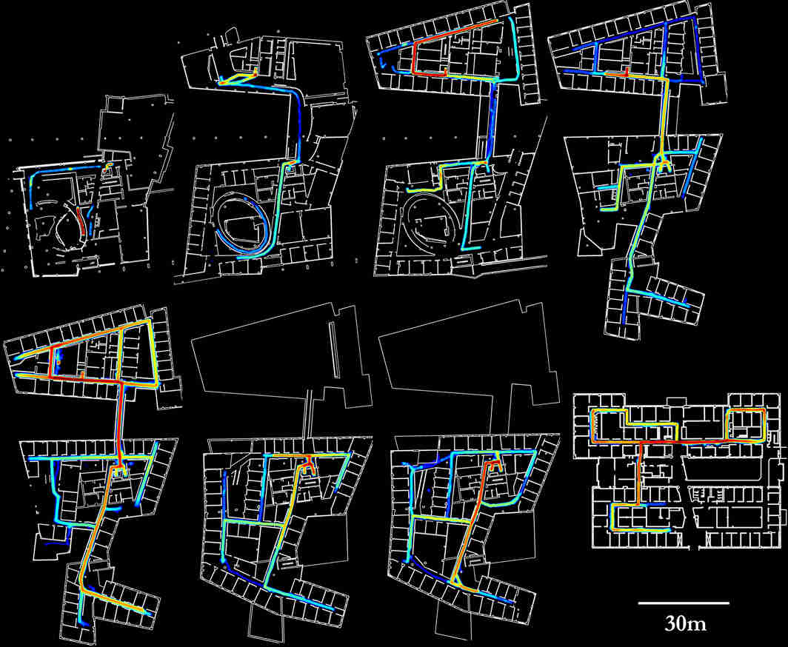

For current research, please see the website for the [Autonomous Mobile Robotics
Laboratory](https://amrl.cs.utexas.edu) at UMass Amherst. This page lists my
research as a PhD student and earlier, for archival purposes.

---

My PhD thesis at Carnegie Mellon University was on robust and accurate long-term
mobile robot localization in varying environments. We had multiple CoBots
deployed in our buildings, which covered 1000 km over deployments to demonstrate
the reliability and robustness of the localization algorithms 
introduced in the thesis, in particular Episodic non-Markov Localization.

 

---

### Longterm Deployments of the CoBots

The CoBots serve as indoor service mobile robots on multiple floors of the
different buildings occupied by the School of Computer Science at Carnegie
Mellon University. The CoBots can be reserved by the building occupants to
perform tasks like delivering packages, collecting and delivering mail to and
from multiple offices, escorting visitors, delivering spoken messages, and
serving as semi-autonomous telepresence robots. We are interested in having
continuously deployed robots in the human environment, and my research is
focused on having the robots be robust to the presence of unmapped movable and
moving objects, as well as the inevitable changes in such a large deployment
environment.

 

Over the course of the deployments, the robots have traversed hundreds of
kilometers, and the sensor logs from the CoBots, invaluable to my research, are
publicly available here in the hope that they may be of use to other researchers
as well. [pdf]() [data](https://www.cs.cmu.edu/~coral/cobot/data.html)

Over the course of regular deployments of the CoBots, we have been logging
sensor data, as well as the reported location of the CoBots (as computed by the
on-board localization algorithms) and the locations where the localization was
reset. The sensor data logged include the observed robot odometry and the laser
rangefinder observations. Please cite our paper (listed below) if you use this
data in your research. 

The logs are saved in the [ROS bag format](http://www.ros.org/wiki/Bags). Laser messages are in the standard
[sensor_msgs/LaserScan](http://docs.ros.org/api/sensor_msgs/html/msg/LaserScan.html) format, odometry in the standard [nav_msgs/Odometry](http://docs.ros.org/api/nav_msgs/html/msg/Odometry.html) format,
and localization initialization and location estimates in the custom
[cobot_msgs/LocalizationMsg](assets/LocalizationMsg.msg) format. The bag files,
and the maps used for localization  are available for download from
[here](https://drive.google.com/drive/folders/156FOy0Y-bmk7R_Y3xS8Ubl1C--h3aAWO?usp=sharing).



---

### Corrective Gradient Refinement for indoor mobile robot localization
The Corrective Gradient Refinement (CGR) algorithm for Monte Carlo Localization
(MCL) uses the state space gradients of the observation model to improve
accuracy while maintaining low computational requirements. This work was
presented at IROS 2011 in the paper titled "Corrective Gradient Refinement for
Mobile Robot Localization"

---

### Fast Sampling Plane Filtering of Depth Images

Fast Sampling Plane Filtering (FSPF) is a RANSAC based algorithm for extracting
3D points corresponding to planar features, given a depth image. The plane
filtered points may be used for localization, or to build polygon maps of
environments. A workshop paper on the topic was presented in the RGB-D 2011
Workshop [pdf]. A complete paper ("Planar Polygon Extraction and Merging from
Depth Images") was presented at IROS 2012 [pdf]. The video demonstrates
real-time plane filtering, polygonalization and polygon merging for a scene
observed using the Kinect sensor. The source code is available on the mercurial
repository [here].



---

### Kinect Localization using plane filtered point clouds

CoBot uses depth camera sensors for localization and for safe navigation. The
depth camera localization algorithm uses plane filtered points generated by FSPF
with CGR to localize a robot on a vector map. It runs in real time on the CoBots
at full frame rates and at full resolution (640x480 @30fps) while consuming <20%
CPU on a single core of the Intel Core i5 540M (2.53GHz) processor. The mean
localization error of the robot over experiment trials (of length >4km) while
using the Kinect for localization is <20cm and <0.5°. This work was presented at
ICRA 2012 in the paper titled "Depth Camera Based Indoor Mobile Robot
Localization and Navigation" [pdf]. The video demonstrates real-time
localization using the Kinect sensor on CoBot2. Source code is available [here].



---

### CoBot as a Visitor Tour Guide

During the summer of 2010, I interned at Intel Research Pittsburgh. Working with
Brian Coltin, we developed a semi-autonomous telepresence role and a visitor
tour guide role for CoBot 2. We succesfully demonstrated CoBot 2 during the 2010
Intel Research Pittsburgh Open house, and over course of the day, escorted
visitors around the labs, introducing them to the various research projects on
display. CoBot 2 autonomously navigated through dense crowds while interacting
with the visitors. The video below shows CoBot 2 in action during the open
house.



---

### CMDragons (Small Size League Robot Soccer)

I led the CMDragons RoboCup SSL team at CMU for several years, and won the 2015
RoboCup, and came second in 2010, 2013, and 2014. I worked on several parts of
the robot soccer problem, including time-optimal interception, motion control,
attack and passing strategy, and the threat-based defense. Our "Coerce and
Attack Planner", developed in 2013, was instrumental in succesful freekick
execution, and is detailed in the AAMAS 2014 paper titled "Opponent-Driven
Planning and Execution for Pass, Attack, and Defense in a Multi-Robot Soccer
Team" [pdf].






---

### Wifi localization and navigation for autonomous indoor mobile robots

We developed a WiFi based localization system which localized cobot on a graph
based map including WiFi data (Means and Standard Deviations) at every vertex of
the graph. CoBot 1 succesfully localized and navigated autonomously along this
graph based map. For a detailed description of the WiFi based localization
algorithm, please refer to the paper "Wifi localization and navigation for
autonomous indoor mobile robots", Joydeep Biswas and Manuela Veloso, ICRA 2010,
available [here].

---

### Reactobot: A reaction wheel stabilized enclosed single-wheel robot

My undergraduate B.Tech project was on the design, construction and control of
Reactobot, a reaction wheel stabilized single wheel robot. Reactobot consists of
a sealed transparent single wheel shell, which encloses all the electronics and
mechanical parts. The robot is balanced on the wheel edge by controlling a
reaction wheel suspended from the axle of the wheel. Forward / reverse drive is
achieved by displacing the suspended mass forward or back, controlled by
actuating the wheel axle. The robot is capable of balancing on its wheel edge
while standing in place. Turns are executed by yawing the wheel while driving
the robot forward. The video below demonstrates the capabilities of Reactobot.


